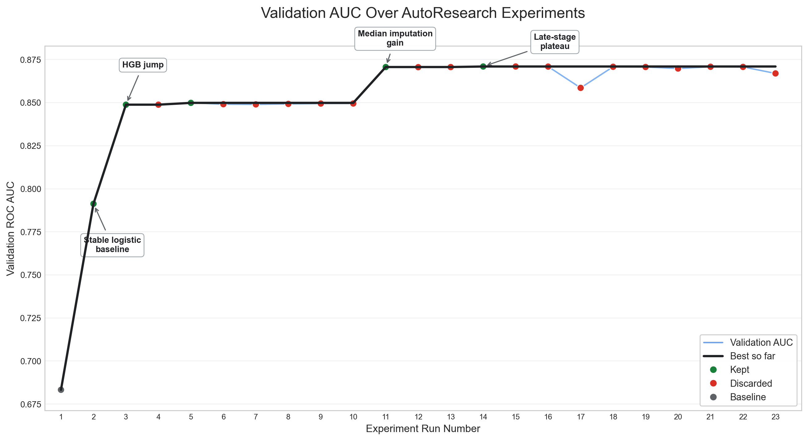

# Credit Default AutoResearch

This project runs controlled experiments for a credit default prediction task.
The target is `SeriousDlqin2yrs`, where `1` means a borrower became seriously
delinquent within two years.

## Evaluation

The objective is to maximize validation ROC AUC. Higher is better.

The validation split is fixed in `prepare.py`, and dry-run experiments evaluate
only on the validation set. The locked test set is loaded but not evaluated
during these experiments.

The first recorded run is treated as the baseline. Every later experiment is
compared with the best validation AUC seen so far, regardless of whether the
change is a model, preprocessing, imputation, or hyperparameter change.

## Experiment Rules

- Only `model.py` is editable during model experiments.
- `prepare.py` and `run.py` are frozen.
- `build_model()` must return an sklearn-compatible estimator.
- Training and validation evaluation must complete in under 60 seconds on CPU.
- No external data sources or test-set evaluation are used during autoresearch
  loops.
- New dependencies are avoided during normal autoresearch loops. `xgboost` and
  `lightgbm` were installed only for explicit, controlled model-family
  comparison experiments.

## Current Best Model

The current best retained model is a pipeline with median imputation followed
by a `HistGradientBoostingClassifier`:

```python
Pipeline([
    ("imputer", SimpleImputer(strategy="median")),
    ("model", HistGradientBoostingClassifier(
        learning_rate=0.03,
        max_iter=200,
        max_leaf_nodes=31,
        l2_regularization=0.05,
        random_state=42
    ))
])
```

Current best validation AUC:

```text
0.870970
```

## Final Evaluation

The final locked-test evaluation is implemented in `final_test_eval.py`. It
uses the retained HGB pipeline above, retrains on the combined training and
validation rows, and evaluates the locked test set once at the end.

Final locked test ROC AUC:

```text
0.871004
```

This is separate from the autoresearch loop: validation AUC was used to choose
the model, then the final model was fit on `train + validation` before the
single locked-test evaluation.

## Baselines And Stability

`final_results.md` records the baseline and cross-validation summary:

| Model | Purpose | Validation AUC |
| --- | --- | ---: |
| Initial Logistic Regression | early exploratory baseline | 0.6833 |
| Stable Logistic Baseline | frozen reproducible benchmark | 0.7913 |

| Model | Mean CV AUC | Std |
| --- | ---: | ---: |
| Logistic baseline | 0.7905 | 0.0039 |
| Final HGB pipeline | 0.8653 | 0.0038 |

The final HGB pipeline is materially stronger than the logistic baseline, with
similar cross-validation variability.

## Experiment Results

`results.tsv` is the single structured experiment log. Richer notes,
interpretation, runtime, and warning details are tracked in
`autoresearch_log.md`.

### Metric Over Time

The plot below shows validation AUC by experiment run number using the rows in
`results.tsv`.



Regenerate the plot with:

```bash
.venv/bin/python plots.py
```

### Experiments

| Description | Status | Validation AUC | Notes |
| --- | --- | ---: | --- |
| `logreg` | original baseline | 0.6833 | First recorded logistic regression result. Older run with incomplete metadata. |
| `debug run` | keep | 0.791284 | Improved over the original baseline; exact model parameters are not recorded in the current files. |
| `hist gradient boosting` | keep | 0.848813 | Large improvement over logistic-regression baseline. |
| `hgb max_iter 400` | discard | 0.848813 | Matched the best at the time but did not improve; change was not retained. |
| `hgb max_leaf_nodes 15` | keep | 0.849862 | Improved the best boosting result. |
| `hgb max_leaf_nodes 10` | discard | 0.849096 | More constrained trees underperformed the best AUC so far. |
| `hgb max_leaf_nodes 20` | discard | 0.848987 | Additional leaf capacity underperformed the best AUC so far. |
| `hgb l2_regularization 0.05` | discard | 0.849262 | Weaker L2 regularization underperformed the best AUC so far. |
| `hgb l2_regularization 0.2` | discard | 0.849466 | Stronger L2 regularization underperformed the best AUC so far. |
| `hgb learning_rate 0.03` | discard | 0.849493 | Lower learning rate did not exceed the best AUC so far. |
| `median imputer hgb` | keep | 0.870665 | Retaining missing-value rows with median imputation inside the pipeline improved the best AUC so far. |
| `hgb max_leaf_nodes 15 with imputer` | discard | 0.870596 | Reduced tree capacity from 31 to 15 after adding median imputation; slightly worse than the best AUC so far. |
| `hgb learning_rate 0.05 with imputer` | discard | 0.870643 | Increased learning rate from 0.03 to 0.05 after adding median imputation; nearly tied but did not improve. |
| `hgb l2_regularization 0.05 with imputer` | keep | 0.870970 | Reduced L2 regularization from 0.1 to 0.05 after adding median imputation; current best retained model. |
| `hgb max_iter 300 with imputer` | discard | 0.870970 | Matched the current best but did not improve, so the longer run was not retained. |
| `median imputer missing indicators hgb` | discard | 0.870913 | Added missingness indicators for `MonthlyIncome` and `NumberOfDependents`; slightly underperformed the retained pipeline. |
| `xgboost default hist with median imputer` | discard | 0.858567 | Controlled XGBoost comparison underperformed the retained HGB direction. |
| `hgb class_weight balanced with imputer` | discard | 0.870814 | Balanced class weighting slightly reduced validation AUC. |
| `quantile clipping 0.5 99.5 with imputer hgb` | discard | 0.870692 | Clipping all features to train-fitted 0.5th/99.5th percentiles reduced validation AUC. |
| `domain ratios and bins with imputer hgb` | discard | 0.869795 | Added lightweight domain ratios and bins; reduced validation AUC. |
| `past due sentinel flags with median imputer hgb` | discard | 0.870831 | Added indicators for `96`/`98` past-due sentinel-like values; slightly underperformed the retained pipeline. |
| `clip DebtRatio and revolving utilization only with imputer hgb` | discard | 0.870739 | Clipped only the two requested heavy-tail columns; still underperformed the retained pipeline. |
| `lightgbm default with median imputer` | discard | 0.866955 | Final controlled LightGBM comparison underperformed HGB and did not justify further model-family exploration. |

## Search Conclusion

The retained model remains median imputation plus
`HistGradientBoostingClassifier` with validation AUC `0.870970` and final locked
test ROC AUC `0.871004`. Later controlled experiments with missing indicators,
class weighting, clipping, sentinel handling, domain feature bundles, XGBoost,
and LightGBM did not improve validation AUC. Under the locked search priorities,
further model-family exploration is not justified without new evidence.

## Running an Experiment

Use the project virtual environment:

```bash
.venv/bin/python run.py "short experiment description"
```

`run.py` trains the estimator returned by `build_model()`, evaluates validation
AUC, and appends the result to `results.tsv`.

After each run, update `autoresearch_log.md` with the richer human-readable
experiment notes, including interpretation, runtime, and any warnings or
failure modes.
