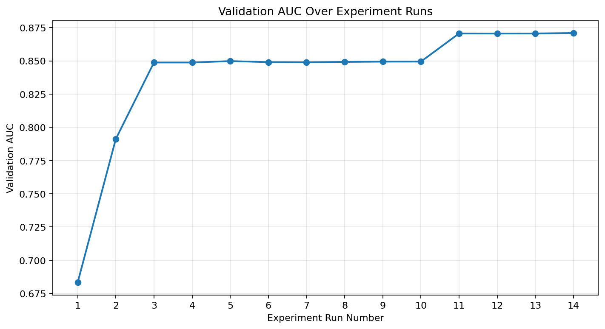

# Credit Default AutoResearch

This project runs controlled experiments for a credit default prediction task.
The target is `SeriousDlqin2yrs`, where `1` means a borrower became seriously
delinquent within two years.

## Evaluation

The objective is to maximize validation ROC AUC. Higher is better.

The validation split is fixed in `prepare.py`, and dry-run experiments evaluate
only on the validation set. The locked test set is loaded but not evaluated
during these experiments.

The first recorded run is treated as the baseline. Every later experiment is
compared with the best validation AUC seen so far, regardless of whether the
change is a model, preprocessing, imputation, or hyperparameter change.

## Experiment Rules

- Only `model.py` is editable during model experiments.
- `prepare.py` and `run.py` are frozen.
- `build_model()` must return an sklearn-compatible estimator.
- Training and validation evaluation must complete in under 60 seconds on CPU.
- No external data sources, downloads, new dependencies, or test-set evaluation
  are used during autoresearch loops.

## Current Best Model

The current best retained model is a pipeline with median imputation followed
by a `HistGradientBoostingClassifier`:

```python
Pipeline([
    ("imputer", SimpleImputer(strategy="median")),
    ("model", HistGradientBoostingClassifier(
        learning_rate=0.03,
        max_iter=200,
        max_leaf_nodes=31,
        l2_regularization=0.05,
        random_state=42
    ))
])
```

Current best validation AUC:

```text
0.870970
```

## Experiment Results

`results.tsv` is the single structured experiment log. Richer notes,
interpretation, runtime, and warning details are tracked in
`autoresearch_log.md`.

### Metric Over Time

The plot below shows validation AUC by experiment run number using the rows in
`results.tsv`.



Regenerate the plot with:

```bash
.venv/bin/python plots.py
```

### Experiments

| Description | Status | Validation AUC | Notes |
| --- | --- | ---: | --- |
| `logreg` | original baseline | 0.6833 | First recorded logistic regression result. Older run with incomplete metadata. |
| `debug run` | keep | 0.791284 | Improved over the original baseline; exact model parameters are not recorded in the current files. |
| `hist gradient boosting` | keep | 0.848813 | Large improvement over logistic-regression baseline. |
| `hgb max_iter 400` | discard | 0.848813 | Matched the best at the time but did not improve; change was not retained. |
| `hgb max_leaf_nodes 15` | keep | 0.849862 | Improved the best boosting result. |
| `hgb max_leaf_nodes 10` | discard | 0.849096 | More constrained trees underperformed the best AUC so far. |
| `hgb max_leaf_nodes 20` | discard | 0.848987 | Additional leaf capacity underperformed the best AUC so far. |
| `hgb l2_regularization 0.05` | discard | 0.849262 | Weaker L2 regularization underperformed the best AUC so far. |
| `hgb l2_regularization 0.2` | discard | 0.849466 | Stronger L2 regularization underperformed the best AUC so far. |
| `hgb learning_rate 0.03` | discard | 0.849493 | Lower learning rate did not exceed the best AUC so far. |
| `median imputer hgb` | keep | 0.870665 | Retaining missing-value rows with median imputation inside the pipeline improved the best AUC so far. |
| `hgb max_leaf_nodes 15 with imputer` | discard | 0.870596 | Reduced tree capacity from 31 to 15 after adding median imputation; slightly worse than the best AUC so far. |
| `hgb learning_rate 0.05 with imputer` | discard | 0.870643 | Increased learning rate from 0.03 to 0.05 after adding median imputation; nearly tied but did not improve. |
| `hgb l2_regularization 0.05 with imputer` | keep | 0.870970 | Reduced L2 regularization from 0.1 to 0.05 after adding median imputation; current best retained model. |

## Running an Experiment

Use the project virtual environment:

```bash
.venv/bin/python run.py "short experiment description"
```

`run.py` trains the estimator returned by `build_model()`, evaluates validation
AUC, and appends the result to `results.tsv`.

After each run, update `autoresearch_log.md` with the richer human-readable
experiment notes, including interpretation, runtime, and any warnings or
failure modes.
